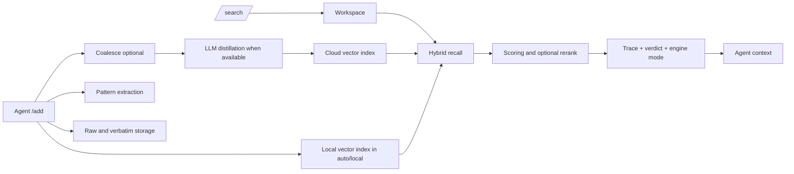

# AGENTS.md — Deploy, Verify, Operate aiduMEI

aiduMEI is a self-hosted long-term memory and wisdom engine for AI agents. It stores extracted facts, raw records, core memory, and recall traces behind a local HTTP API. It works with your host's native memory as the durable long-term layer; the host remains responsible for short-term conversation state.

## Choose your engine mode

| Need | Mode | Requires | Effect |
|---|---|---|---|
| Lowest footprint | `AIDUMEI_ENGINE_MODE=cloud` | Cloud LLM + embedding keys | No local model; during an outage recall is honestly `degraded` |
| Default resilience | `AIDUMEI_ENGINE_MODE=auto` | Cloud keys + `pip install .[local-embed]` + model fetch | Cloud-first, automatic local fallback and recovery |
| Fully local | `AIDUMEI_ENGINE_MODE=local` | Local embed dependencies and model; no API keys | Zero cloud tokens and zero outbound model calls |

Changing mode requires a service restart. If you previously ran `cloud`, run the local-vector backfill before expecting the local gear to recall older memories.

## Install and start

```bash
git clone https://github.com/monkey2jack/aiduMEI.git
cd aiduMEI
python3.12 -m venv .venv && source .venv/bin/activate
pip install -r requirements.txt
cp mem0_config_local.json.example mem0_config_local.json
cp .env.example .env
# Edit mem0_config_local.json: set llm.config and embedder.config.
# Edit .env: set AIDUMEM_ENTITY_KEYWORDS and, if exposing beyond loopback, AIDUMEM_API_TOKEN.
python api_server.py
```

For `auto` or `local`, also run:

```bash
pip install .[local-embed]
python scripts/fetch_local_embed_model.py
```

## Prove memory is actually working

Run the end-to-end smoke after the service starts:

```bash
python scripts/e2e_smoke.py --json
```

Expected output: JSON ending with `"status": "PASS"`, zero failures, and zero warnings; process exit code 0. `/health: ok` alone is not sufficient — this script writes a nonce, recalls it from a new request, checks trace visibility, and cleans up its temporary tenant.

## Three probes to check first

```bash
curl -s http://127.0.0.1:8767/health | jq '.health_status, .degraded, .probes.runtime_paths'
```

1. `health_status` must be `ok`.
2. `degraded` must explain every unavailable component.
3. `probes.runtime_paths.data_dir` must be the directory you intended to persist, and `data_dir_writable` must be true.

## Operate

- Health and failures: `docs/HEALTH.md`
- Daily and periodic jobs: `docs/OPERATIONS.md`
- Failure scenarios and runbooks: `TROUBLESHOOTING.md`
- Backup, restore, upgrade, rollback: `docs/BACKUP_RESTORE.md`
- Host integration and memory ownership: `docs/AGENT_INTEGRATION.md`
- Script index: `scripts/README.md`

## End-to-end data flow


