<p align="center">
  
</p>

# aiduMEI⚕爱嘟优忆思——智能体通用思想系统

> **aidu Memory Engine Insight**
>
> *不只是记忆 — 是洞察。*
>
> *记忆不是记事，而是不忘过往的点点滴滴；*
> *洞察不是看见，而是看懂每一条记忆为何被想起；*
> *引擎不是工具，而是让 AI 会记忆、会思考、会进化。*

[](https://github.com/monkey2jack/aiduMEI)
[](https://github.com/monkey2jack/aiduMEI/pkgs/container/aidumem)
[](LICENSE)
[](https://www.python.org/)
[](https://github.com/mem0ai/mem0)

**中文** | **[📖 English](README_EN.md)**

---

## aiduMEI 是什么？

**aiduMEI**（爱嘟优忆思，aidu Memory Engine Insight）是一个**智能体通用思想系统** —— 为 AI Agent 提供持久化记忆、推理与**可视化洞察**能力。它以希腊神话诸神为名，承载着一套完整的**认知架构**，让 AI **会记忆、会思考、会进化**，并通过自带的**控制台**让一切可见、可调、可追溯。

> **品牌演进**：aiduMEM（优忆思）→ aiduMEI⚕爱嘟优忆思。从一个记忆中间件，升级为带可视化洞察的智能体通用思想系统。"爱嘟"是用户与 AI 助手"助手"的亲密呼唤，"优忆思"是记忆·思考·洞察的三重承诺。

基于 [mem0](https://github.com/mem0ai/mem0) 构建，aiduMEI 在其之上搭建了十层认知体系：

| 层级 | 代号 | 做什么 | 核心特性 |
|------|------|--------|----------|
| 🧠 **回忆** | Mnemosyne 谟涅摩绪涅 | 在对的时间找到对的回忆 | Ebbinghaus 遗忘曲线 + BM25/trigram + 向量混合检索 |
| 🔍 **闸门** | Tahoe-Gate | 只检索真正相关的内容 | 1ms 启发式闸门拦截无关上下文 —— Token 消耗降低 100 倍 |
| 🌊 **潮浪** | Mnemosyne Tidal | 批量 LLM 提取，不逐条调用 | 异步合并队列：多条短消息 → 单次 LLM 调用 |
| ⏳ **遗忘** | Ebbinghaus Decay | 遗忘是特性，不是 bug | 三轨衰减：Identity 零衰减 / Emotion 加速半衰 / 一般事实标准曲线 |
| 🕰️ **克罗诺斯** | Chronos 克罗诺斯 | 时间感知的有效期 | 双时间轴（valid_from / valid_to），过期降权不删除 |
| 🏛️ **万神殿** | Pantheon 万神殿 | 多 Agent 共享一套记忆 | 联邦身份 + MoE 门控 + 四级无缝降级 |
| 🛡️ **埃癸斯** | Aegis 埃癸斯 | 零硬编码，换机即跑 | 身份/路径/词表全部环境变量注入，克隆即用 |
| 🌈 **伊里斯** | Iris 伊里斯 | 走宿主官方记忆通道 | Hermes MemoryProvider 插件：压缩前抢救 · 记忆镜像 · 工具直连 |
| 🐙 **八爪鱼** | Opus Octopod | 记忆治理与结晶 | ConflictResolver 冲突消解 + TreeMemory 树状图谱 + SkillCrystallizer 自动结晶 |
| ⚡ **宙斯** | Zeus 宙斯 | 吸星大法 · 众神之王 | Raw Drawer 原味抽屉 + Code Graph 代码图谱 + EvolveMem 检索自进化 |

---

## 🖥️ aiduMEI 控制台（全新）

> **v18.2 起自带可视化控制台** —— 不再是纯 API 服务，而是一个"看得见记忆如何被想起"的引擎。

aiduMEI 内置一个零依赖的 Web 控制台，由后端直接托管在 `/ui`，无需单独部署前端。六个面板覆盖记忆引擎的完整生命周期：

| 面板 | 代号 | 看什么 |
|------|------|--------|
| 💗 **PULSE 脉搏** | 服务状态 + 存储分层 | 版本/代号/核心模块在线数、四层记忆存量与容量 |
| 🗄️ **VAULT 记忆库** | 搜索 + 分类账本 | 语义检索（向量+重排）、6 知识域分类家底、最近写入的事实流 |
| 🗺️ **MAP 星图** | 知识域星图 | ECharts 力导向图：核心/知识域/分类/实体四类节点，可拖拽缩放 |
| 🔍 **RECALL 追忆** | 召回漏斗 trace | 候选池→点火→去重→时间衰减→最终，每步耗时与命中数全可见 |
| 🧬 **EVOLVE 进化** | 检索质量看板 | 7 天查询/命中/得分/零命中、进化周期日志、反馈信号 |
| ⚙️ **SETTINGS 设置** | 模型配置 + 模块 + 联邦 | LLM/Embedding/Reranker 配置只读（api_key 脱敏）、思考模式、可调参数、核心模块探针、联邦成员 |

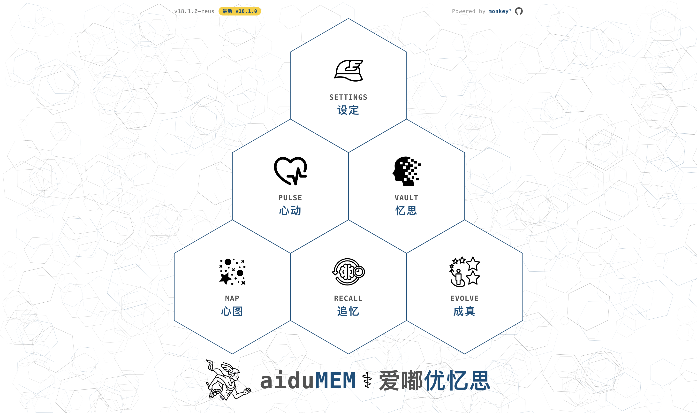

### PULSE — 脉搏

服务健康、版本代号、11 个核心模块探针、四层记忆存量与容量。

<p float="left">
  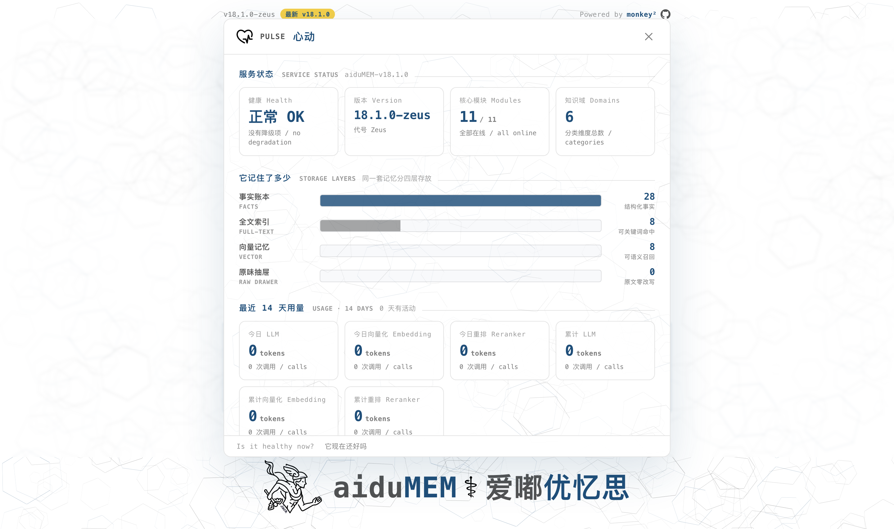
  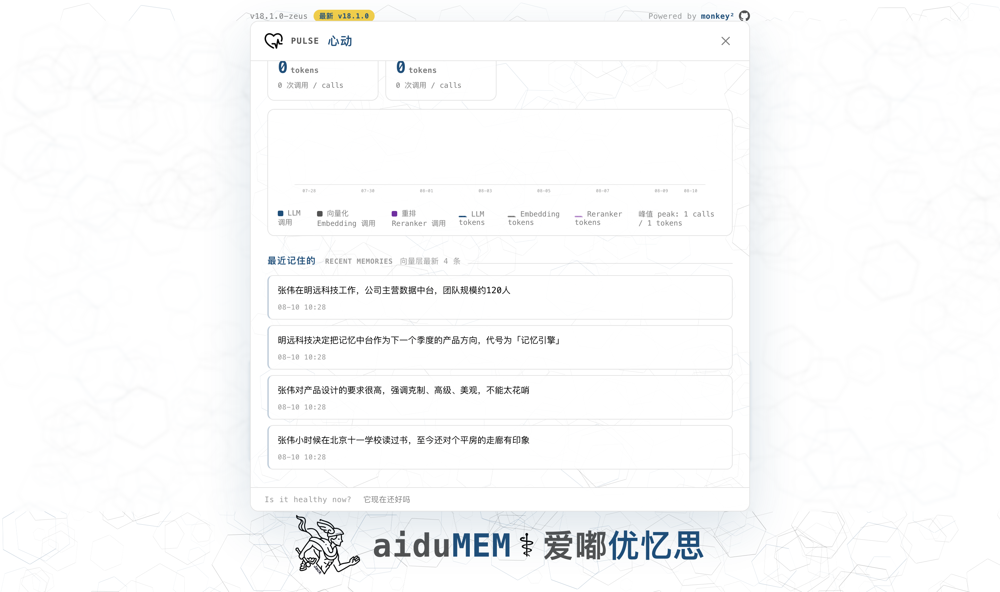
</p>
<p float="left">
  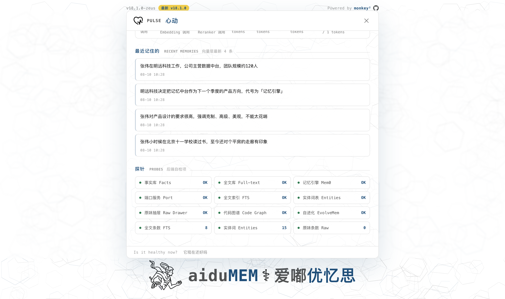
</p>

### VAULT — 记忆库

语义检索（向量 + 重排）、6 个知识域分类家底、最近写入的事实流。

<p float="left">
  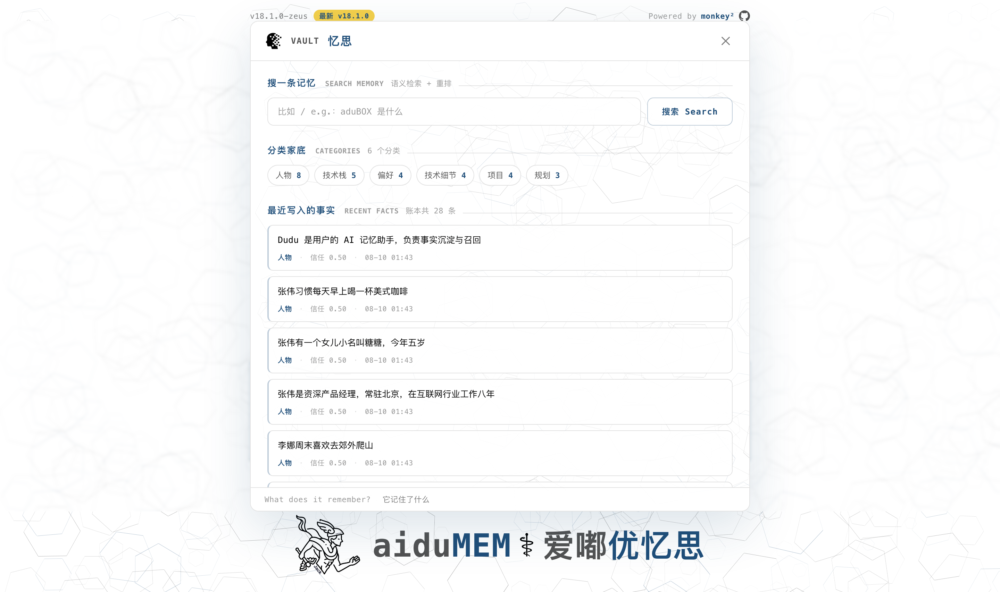
  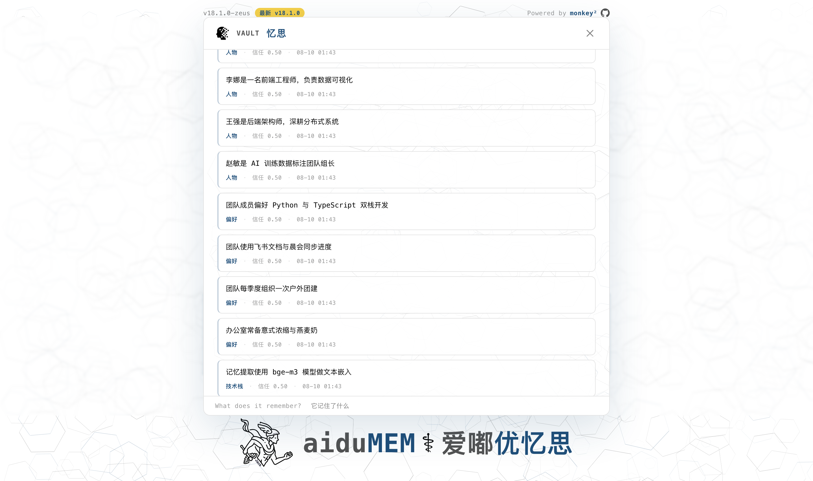
</p>
<p float="left">
  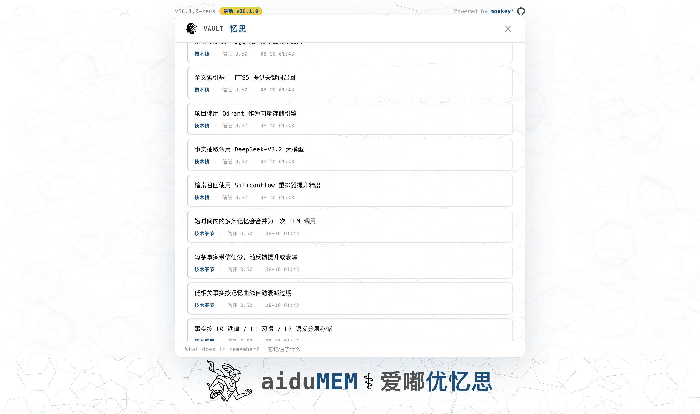
</p>

### MAP — 知识域星图

ECharts 力导向图，核心 / 知识域 / 分类 / 实体四类节点，滚轮缩放、拖拽节点、悬停查看详情。

<p float="left">
  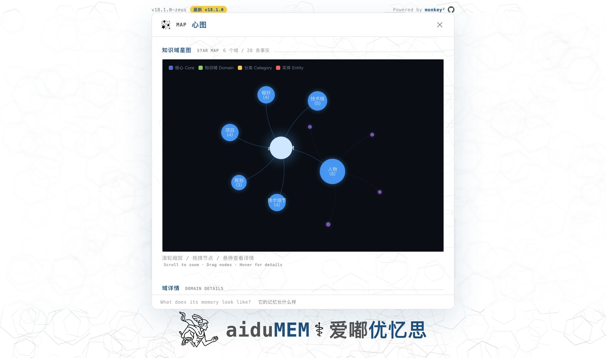
  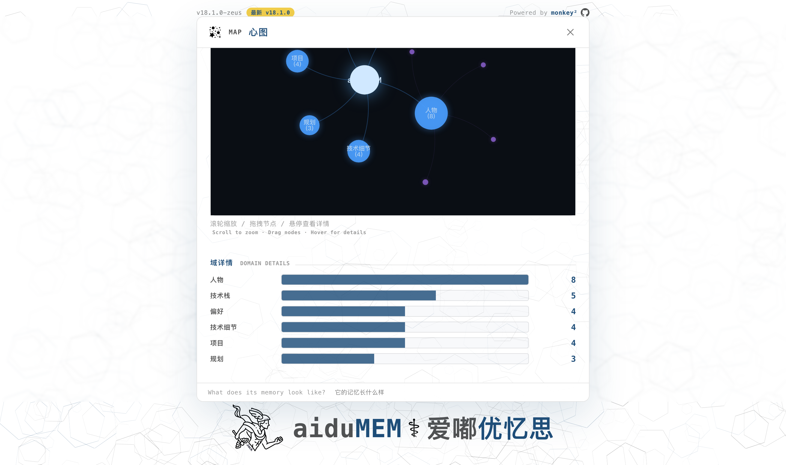
</p>

### RECALL — 追忆漏斗

> 这一屏是 aiduMEI 最想做好的地方：别家的记忆面板只给你"存了什么"，这里给你"它凭什么想起这条"。

候选池 → 🔥 点火 → 去重 → 时间衰减 → 最终，五阶段每步耗时与命中数全可见。

<p float="left">
  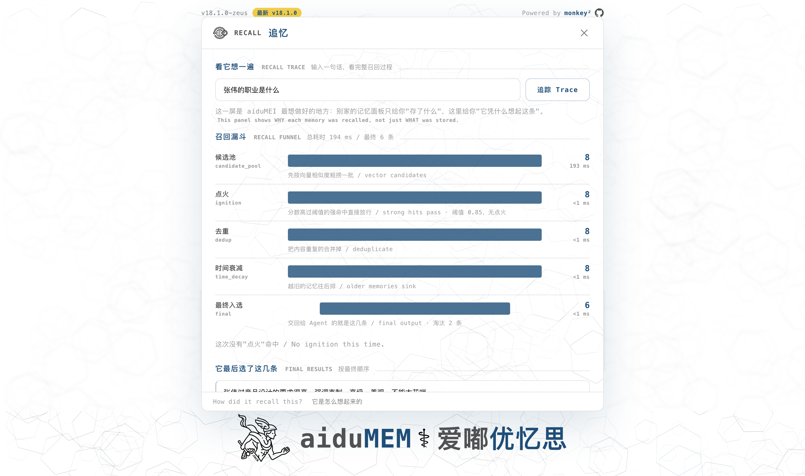
  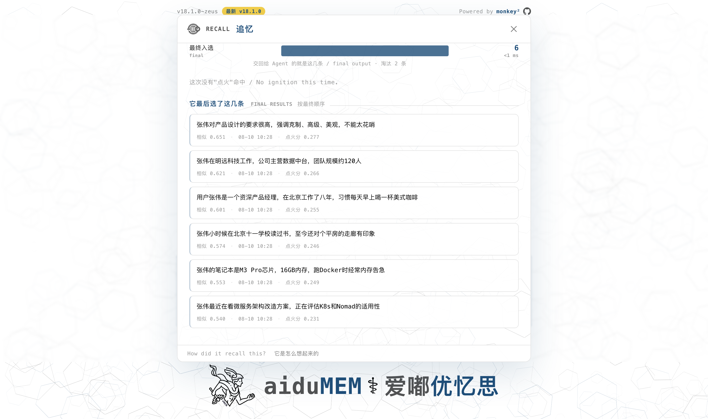
</p>

### EVOLVE — 检索自进化

7 天检索质量看板：查询数、平均命中、平均得分、零命中数；进化周期日志与反馈信号。

<p float="left">
  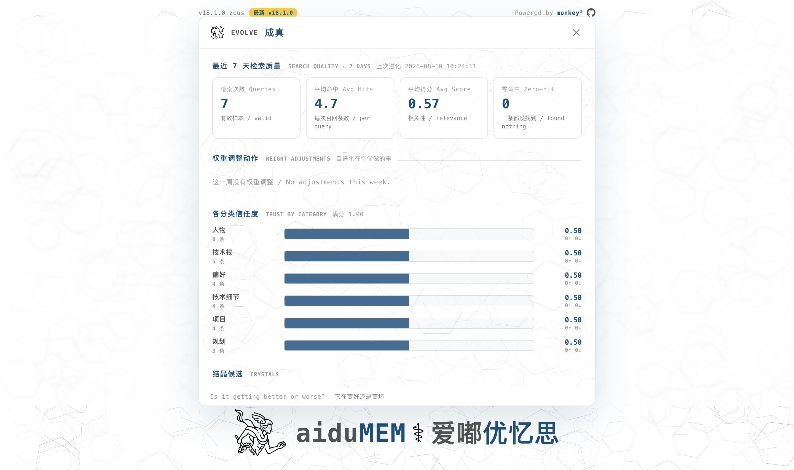
  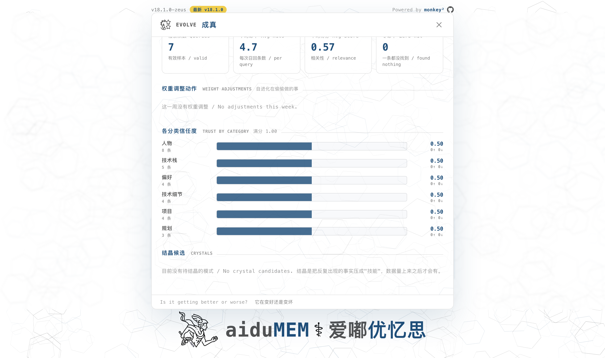
</p>

### SETTINGS — 模型配置

LLM / Embedding / Reranker 配置只读展示（api_key 自动脱敏）、思考模式状态、可调参数、核心模块探针、联邦成员。

<p float="left">
  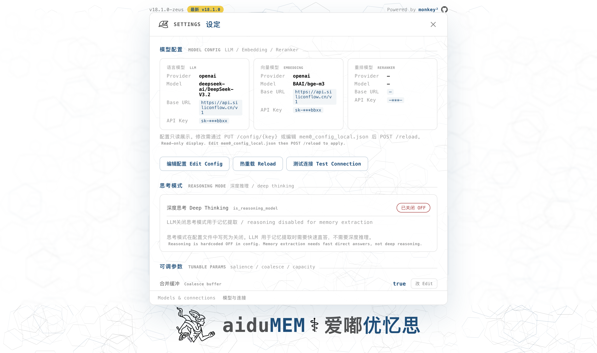
  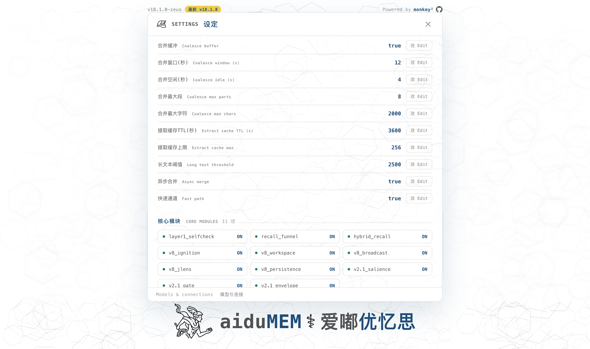
</p>
<p float="left">
  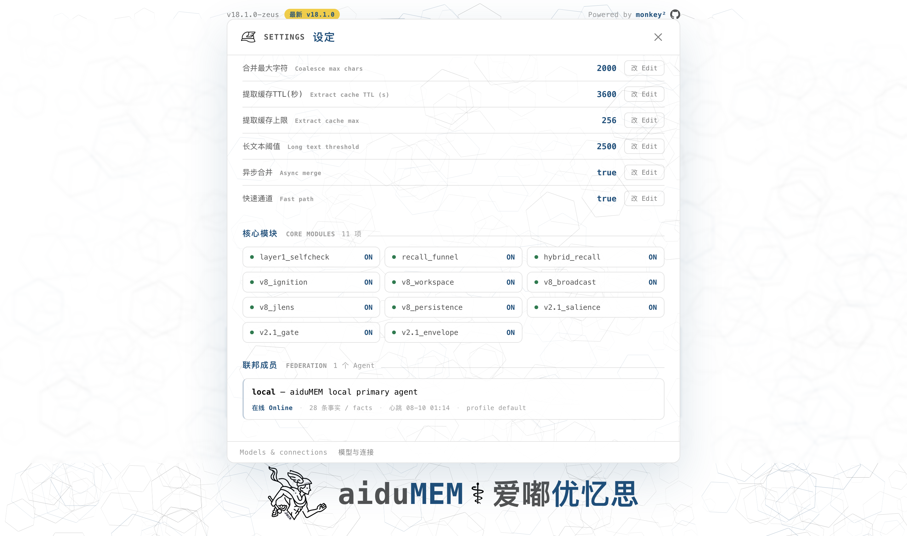
</p>

> 控制台由后端 `api_server.py` 直接托管在 `/ui`，前端是零依赖的纯静态文件（HTML + CSS + JS + PNG 图标），不打包、不编译、不装 node。克隆仓库 → 启动 → 浏览器打开 `http://localhost:8767/ui/` 即用。

---

## 诸神谱系

> aiduMEI 的每个大版本以希腊神祇命名，神格即架构。

| 版本 | 代号 | 神格 | 核心使命 |
|------|------|------|----------|
| **v18.2** | **Zeus** · 宙斯 | 众神之王 · 检索自进化 | EvolveMem 反馈闭环、38 MCP 工具、质量审计全覆盖、**自带可视化控制台** |
| **v18.0** | **Zeus** · 宙斯 | 众神之王 · 吸星大法 | 原味抽屉 · 代码图谱 · 五大竞品精华融合 · MCP×36 · IDE 钩子 |
| **v17.0** | **Themis** · 忒弥斯 | 秩序女神 | 事件账本 · 敏感分档 · 治理铁律 |
| **v16.0** | **Opus Octopod** · 八爪鱼 | 深海智者 | 冲突消解 · 树状记忆 · 技能结晶 |
| **v15.0** | **Iris** · 伊里斯 | 彩虹信使 | 官方 MemoryProvider 通道 · 惰性热载 |
| **v14.0** | **Aegis** · 埃癸斯 | 神盾 | 零硬编码 · 隐私护盾 · 开箱可部署 |
| **v13.0** | **Pantheon** · 万神殿 | 众神之殿 | 多 Agent 联邦 · MoE 门控 |
| **v12.0** | **Chronos** · 克罗诺斯 | 时间之神 | 双时间轴有效期 |
| **v11.0** | **Hyperion** · 海伯利安 | 光明之神 | 线程本地连接池 · 性能纪元 |
| **v9.1** | **Mnemosyne** · 谟涅摩绪涅 | 记忆女神 | 潮浪并忆 · 双策分档 |

[完整版本演进史 →](CHANGELOG.md)

---

## 架构

```
┌──────────────────────────────────────────────────────────┐
│           aiduMEI⚕爱嘟优忆思 v18.2          │
│              FastAPI REST API :8767                       │
│              控制台 /ui :8767（自带静态托管）              │
│              MCP Server :8768 (38 tools)                  │
├──────────────────────────────────────────────────────────┤
│  Core (HOT)      → 搜索、添加、CRUD、健康检查              │
│  v8 Pipeline     → 点火 · 工作区 · 广播 · 镜鉴 · 会话      │
│  Clotho/Hyperion → CoreMemory · 检查点 · AutoDream       │
│  Extended        → 15脉外延：自动记忆 · 过期 · 统计        │
│  Federation      → 多 Agent 联邦 · MoE 门控 · 四级降级     │
│  Octopus         → 冲突消解 · 树状记忆 · 技能结晶          │
│  Zeus            → 原味抽屉 · 代码图谱 · 检索自进化         │
│  Themis          → 事件账本 · 敏感分档 · 治理审计          │
│  aiduMEI 控制台  → PULSE · VAULT · MAP · RECALL · EVOLVE · SETTINGS │
├──────────────────────────────────────────────────────────┤
│  mem0 (向量记忆) + Qdrant (向量存储)                       │
│  facts.db (结构化知识 · FTS5 trigram 全文搜索)             │
│  EvolveMem 检索自进化引擎 (后台自动衰减/提权)               │
└──────────────────────────────────────────────────────────┘
```

---

## 快速开始

### 方式一：Docker 容器运行（GitHub Packages / GHCR）

```bash
docker pull ghcr.io/monkey2jack/aidumei:latest
docker run -d -p 8767:8767 --name aidumei ghcr.io/monkey2jack/aidumei:latest
```

### 方式二：源码克隆运行（含控制台）

```bash
# 1. 克隆
git clone https://github.com/monkey2jack/aiduMEI.git
cd aiduMEM

# 2. 创建虚拟环境
python3.12 -m venv venv
source venv/bin/activate

# 3. 安装依赖
pip install -r requirements.txt

# 4. 配置（复制并编辑）
cp mem0_config_local.json.example mem0_config_local.json
# 编辑 mem0_config_local.json，填入你的 LLM 和 Embedding API Key

# 5. 启动
python api_server.py
# API 运行在 http://localhost:8767
# 控制台打开 http://localhost:8767/ui/
```

> 💡 想让相关性闸门认得你自己的人名/项目代号？把它们填进环境变量 `AIDUMEM_ENTITY_KEYWORDS`，用 `|` 分隔，重启即生效。

---

## 核心接口

### 记忆操作

| 方法 | 路径 | 说明 |
|------|------|------|
| `POST` | `/search` | 搜索记忆（混合：向量 + BM25 + 相关性闸门） |
| `POST` | `/search_trace` | 带完整执行链路的搜索（召回漏斗 trace） |
| `POST` | `/add` | 添加记忆（默认异步潮浪合并） |
| `POST` | `/add/raw` | 原味抽屉——零 LLM 直存原始文本 |
| `DELETE` | `/delete` | 按 ID 删除记忆 |
| `GET` | `/health` | 健康检查 + 全探针诊断 |

### 控制台配置（v18.2 新增）

| 方法 | 路径 | 说明 |
|------|------|------|
| `GET` | `/config` | 模型配置只读视图（api_key 脱敏） |
| `GET` | `/config/_speed` | 速度/合并可调参数 |
| `POST` | `/config/_speed` | 在线微调参数（写入 mem0_config_local.json） |

> 前端控制台以 `/api` 为调用根（`API.base = '/api'`）。后端挂了一个 `/api` 别名子应用，让 `/api/stats`、`/api/config` 等直接命中扁平路由，无需改前端。访问 `/` 自动重定向到 `/ui/`。

### 代码图谱（Zeus v18.0）

| 方法 | 路径 | 说明 |
|------|------|------|
| `POST` | `/code/impact` | 分析文件改动波及范围（爆炸半径） |
| `GET` | `/code/graph` | 查看全项目代码依赖图 |

### 检索自进化（Zeus v18.2）

| 方法 | 路径 | 说明 |
|------|------|------|
| `POST` | `/evolve/feedback` | 提交检索质量反馈（useful / useless / correction） |
| `GET` | `/evolve/report` | 进化统计面板（召回率、权重调整历史） |

### 八爪鱼治理（Opus v16.0）

| 方法 | 路径 | 说明 |
|------|------|------|
| `POST` | `/conflict/resolve` | 冲突消解（域名迁移、名称变更自动降权） |
| `GET` | `/tree/nodes` | 树状记忆图谱节点列表 |
| `POST` | `/crystals/detect` | 检测可结晶的高频重复事实 |
| `GET` | `/crystals` | 查看技能结晶候选项 |

### 万神殿联邦（Pantheon v13.0）

| 方法 | 路径 | 说明 |
|------|------|------|
| `GET` | `/federation/recall` | 联邦检索（MoE 门控自动决策热/联邦通道） |
| `POST` | `/federation/facts/add` | 联邦写入（自动去重 + 分层 + 归属） |
| `GET` | `/federation/agents` | Agent 列表（含事实数与在线状态） |
| `POST` | `/federation/agents/register` | 注册 Agent 到联邦 |
| `GET` | `/federation/broadcast` | 拉取其他 Agent 的新共享事实 |
| `GET` | `/federation/awareness` | 联邦态势摘要 |

### 示例

```bash
# 搜索记忆
curl -s -X POST http://localhost:8767/search \
  -H "Content-Type: application/json" \
  -d '{"query": "我之前说过项目截止日期是什么？", "user_id": "me", "limit": 5}'

# 带召回漏斗 trace 的搜索
curl -s -X POST http://localhost:8767/search_trace \
  -H "Content-Type: application/json" \
  -d '{"query": "张伟的职业是什么", "user_id": "default", "limit": 3}'

# 添加记忆
curl -s -X POST http://localhost:8767/add \
  -H "Content-Type: application/json" \
  -d '{"messages": "[{\"role\":\"user\",\"content\":\"项目截止日期是3月15号\"}]", "user_id": "me"}'

# 原味抽屉——直存代码片段，不走 LLM
curl -s -X POST http://localhost:8767/add/raw \
  -H "Content-Type: application/json" \
  -d '{"content": "def hello(): print(\"Hello World\")", "source": "my_script.py", "user_id": "me"}'

# 读取模型配置（控制台用）
curl -s http://localhost:8767/config | python -m json.tool
```

---

## aiduMEI 的独特之处

### 🖥️ 自带可视化控制台（v18.2 全新）

别家的记忆引擎给你一坨 API，自己写前端。aiduMEI 把控制台焊在后端里——克隆即用，六个面板覆盖记忆引擎的完整生命周期。**RECALL 追忆面板**是灵魂：它不只告诉你"存了什么"，而是用召回漏斗 trace 给你看"它凭什么想起这条"——候选池 8 条 → 点火 → 去重 → 时间衰减 → 最终 3 条，每步耗时与命中数全可见。零依赖纯静态前端，不装 node、不打包、不编译。

### 🔮 相关性闸门（Tahoe-Gate）
普通 RAG 系统对每条消息都去搜索记忆。aiduMEI 的**相关性闸门**用启发式 + 动态实体匹配判断当前消息是否真的需要记忆检索。日常闲聊直接跳过 → **Token 消耗降低 100 倍**，响应速度从 10ms 降到 1ms。

### 🌊 潮浪并忆（Mnemosyne Tidal）
短消息不逐条调用 LLM。异步缓冲后按 session 分组，一次 LLM 调用处理多条。Tech / intimate / default 三档策略，快冲慢攒各取所需。

### ⏳ 三轨遗忘曲线（Ebbinghaus Decay）
记忆有保质期。Identity 和 Preference 是永久轨道（零衰减），Emotion 是加速衰减（1.5 倍），一般事实按标准遗忘曲线自然消退。**让 AI 学会忘记不重要的事。**

### 🕰️ 克罗诺斯双时间轴（Chronos Dual Timeline）
`valid_from` / `valid_to` 时间窗口：过期事实降权但不删除，未生效事实排在后面。所有铁律类记忆永不过期。

### ⚡ 原味抽屉（Raw Drawer — Zeus v18.0）
借鉴 MemPalace (58k⭐) 的 Verbatim Storage 理念。零 LLM 直存原始文本——代码片段、完整对话、原始日志，绕过 LLM 总结，一字不丢。FTS5 全文索引 + Qdrant 向量 + facts 登记，三路并行。

### 🔍 代码图谱（Code Graph — Zeus v18.0）
借鉴 code-review-graph (29k⭐) 的 AST 爆炸半径分析。用 Python 标准库 `ast` 解析项目依赖关系，改一个文件一秒告诉你影响范围。

### 📈 检索自进化（EvolveMem — Zeus v18.2）
借鉴 SimpleMem (3.7k⭐) 的进化理念。用户可对每次检索结果打分（useful / useless / correction），后台每 6 小时自动计算衰减/提权。高频优质词条自动沉淀，低质词条温柔降权。**闭环反馈，越用越聪明。**

### 🏛️ 万神殿联邦记忆（Pantheon Federation）
借鉴 MoE（Mixture-of-Experts）思想：底层建成完整的多 Agent 联邦基础设施，日常只激活当前 Agent 的热通道。

- **联邦身份**：每条记忆都带 `agent_id` / `profile` / `shared`，多 Agent 共用一套库互不污染
- **MoE 门控**：默认走热通道（一次 SQL，5ms 级）；仅在显式请求时才唤起其他 Agent
- **四级无缝降级**：L1 本 Agent → L2 分层加权 → L3 同 profile 联邦 → L4 跨 profile 全局
- **写入去重**：Jaccard 三态判定——≥0.85 合并、≥0.70 更新、<0.70 新增

### 🐙 冲突消解与技能结晶（Opus Octopod — v16.0）

- **ConflictResolver**：域名迁移、名称变更自动检测 + 旧值降权。双时间轴失效而非删除，保留完整历史
- **TreeMemory**：`node_path` 层级追溯，事实挂载到树状节点，支持向上追溯祖先
- **SkillCrystallizer**：后台自动感知高频重复事实，提炼为 Skill 候选。LLM 只能建议，**人工 approve 才生效**

### 🛡️ 埃癸斯护盾（Aegis — v14.0）
仓库里没有任何硬编码的身份、绝对路径、服务器地址或密钥。一切可变项走环境变量注入。克隆到任何目录、任何机器，`python api_server.py` 直接跑。

### 🌈 伊里斯彩虹桥（Iris — v15.0）
aiduMEI 提供 **Hermes Agent 官方 MemoryProvider 插件**，拿到全套生命周期钩子——turn 开头注入常驻块与相关检索、每轮后台归档、**压缩前把即将丢掉的对话先落进长期记忆**、镜像宿主内置 MEMORY.md 写入、三个可直接调用的工具。

```bash
cp -r integrations/hermes-plugin/aidumem ~/.hermes/plugins/
hermes config set memory.provider aidumem
```

### 🔧 零配置混合检索
BM25 trigram（零延迟兜底） + 向量嵌入 + Reranker 重排序 + 召回漏斗相关性排序。向量服务超时自动热切换到本地全文搜索。

---

## 接入 Hermes Agent

| 方式 | 能力 | 何时用 |
|------|------|--------|
| **A. MemoryProvider 插件**（推荐） | 全生命周期钩子 + 工具 + 备份 | 默认选这个 |
| **B. Shell Hook** | 仅 turn 开头注入 | 宿主不方便装插件时 |

两种方式**不要同时开**（会重复注入白烧 token）。完整步骤、验证方法与回滚见 [integrations/INTEGRATION_GUIDE.md](integrations/INTEGRATION_GUIDE.md)。

> ⚠️ **安全**：aiduMEI 服务自身不做鉴权，默认只监听 `127.0.0.1`。要跨机访问请在前面挂带认证 + TLS 的反向代理，别把服务直接暴露到公网。

---

## MCP Server（38 工具）

aiduMEI 内置 MCP Server（`:8768`），暴露 38 个工具，分组如下：

| 工具组 | 数量 | 说明 |
|--------|------|------|
| Core CRUD | 6 | add / search / delete / update / recent / stats |
| Facts | 4 | facts_add / facts_search / facts_list / facts_delete |
| Code Graph | 2 | code_impact / code_graph |
| Session | 2 | session_list / session_history |
| Reflect | 2 | reflect_recent / reflect_trace |
| Core Memory | 3 | core_memory_get / core_memory_set / core_memory_list |
| AutoDream | 2 | dream_trigger / dream_status |
| Raw Drawer | 2 | raw_add / raw_search |
| Knowledge Tree | 3 | tree_nodes / tree_node / tree_ancestors |
| Crystals | 3 | crystals_list / crystals_detect / crystals_approve |
| Conflict | 1 | conflict_resolve |
| Evolve | 2 | evolve_feedback / evolve_report |
| Federation | 6 | fed_recall / fed_add / fed_agents / fed_register / fed_broadcast / fed_awareness |

---

## IDE 集成

### Cursor

```bash
# 将规则文件复制到项目
cp integrations/cursor-hook/cursor-aidumem.mdc .cursor/rules/

# 文件保存时自动存入 Raw Drawer
cp integrations/cursor-hook/aidumem-on-save.sh .git/hooks/post-commit
```

### Claude Code

```bash
python integrations/cursor-hook/claude-code-hook.py store --file my_code.py
python integrations/cursor-hook/claude-code-hook.py search --query "database connection"
python integrations/cursor-hook/claude-code-hook.py impact --file ducky/utils.py
```

---

## 技术栈

- **运行时**：Python 3.12+、FastAPI、Uvicorn
- **记忆内核**：mem0 v2.0.17
- **向量存储**：Qdrant（通过 qdrant-client）
- **结构化数据**：SQLite（facts.db、observations.db、scenes.db、fact_events.db）
- **全文搜索**：SQLite FTS5 + trigram 分词器
- **向量化**：可配置（兼容 OpenAI Embedding API）
- **重排序**：可配置（兼容 OpenAI Rerank API · 多 provider 抽象：OpenAI-compatible / Jina / Cohere）
- **大模型**：兼容任何 OpenAI 格式的 API
- **MCP**：fastmcp stdio + HTTP 双模
- **控制台**：零依赖纯静态（HTML + CSS + 原生 JS + ECharts CDN），由后端 `/ui` 直接托管

---

## 配置说明

aiduMEI 从 `mem0_config_local.json` 读取配置。主要字段：

```json
{
  "llm": {
    "provider": "openai",
    "config": {
      "model": "你的模型",
      "api_key": "你的密钥",
      "openai_base_url": "你的接口地址",
      "is_reasoning_model": false,
      "reasoning_effort": "none"
    }
  },
  "embedder": {
    "provider": "openai",
    "config": {
      "model": "your-embedding-model",
      "api_key": "你的密钥",
      "openai_base_url": "你的接口地址"
    }
  },
  "rerank": {
    "enabled": true,
    "provider": "openai_compatible",
    "config": {
      "model": "你的重排模型",
      "api_key": "你的密钥",
      "openai_base_url": "你的接口地址"
    }
  },
  "vector_store": {
    "provider": "qdrant",
    "config": {
      "path": "./data/qdrant",
      "embedding_model_dims": 1024
    }
  }
}
```

> 💡 LLM 的 `is_reasoning_model: false` + `reasoning_effort: "none"` 是刻意写死关闭的——记忆提取需要快速直答，不需要深度推理。控制台 SETTINGS 面板的"思考模式"区块只读展示这一状态。

---

## 环境变量

v14 Aegis 起，所有与部署环境相关的可变项都通过环境变量注入，**全部可选**——不设置就走安全默认值。

| 变量 | 默认值 | 说明 |
|------|--------|------|
| `AIDUMEM_HOME` | 仓库根（`__file__` 自动解析） | 覆盖仓库根目录 |
| `AIDUMEM_DATA_DIR` | `<repo>/data` | 数据库与向量库落盘位置 |
| `AIDUMEM_LOG_DIR` | `<repo>/logs` | 日志目录 |
| `AIDUMEM_CONFIG_FILE` | `<repo>/mem0_config_local.json` | mem0 配置文件路径（由 `AIDUMEM_HOME` 推导，固定文件名） |
| `AIDUMEM_DEFAULT_USER_ID` | `default` | 默认 user_id |
| `AIDUMEM_DEFAULT_AGENT_ID` | `default` | 联邦默认 agent_id |
| `AIDUMEM_API_PORT` | `8767` | API + 控制台监听端口 |
| `AIDUMEM_ENTITY_KEYWORDS` | 空 | 相关性闸门的自定义实体词表，`\|` 分隔 |
| `UI_DIR` | `<repo>/frontend` | 控制台静态文件目录（不存在则仅 API 模式） |
| `AIDUMEM_CONFIG_READONLY` | `0` | 控制台配置只读模式（1=禁止在线改配置） |

完整清单连注释见 [`.env.example`](.env.example)，`cp .env.example .env` 起步。

---

## 路线图

- [x] **v18.2 Zeus** — EvolveMem 检索自进化闭环 + **自带可视化控制台 aiduMEI**
- [x] **v18.0 Zeus** — Raw Drawer · Code Graph · MCP×36 · IDE 钩子
- [x] **v17.0 Themis** — 事件账本 · 敏感分档 · 治理铁律
- [x] **v16.0 Opus Octopod** — 冲突消解 · 树状记忆 · 技能结晶
- [ ] **v19.0** — 多模态记忆（图片 → 视觉描述 → 入库）
- [ ] **v20.0** — OpenViking 统一上下文 DB 融合

---

## 仓库结构

```
aiduMEM/
├── api_server.py          # 主入口（API + /ui 控制台托管）
├── ducky/                 # 业务逻辑（各神祇模块）
│   ├── hot/               #   搜索/健康/遗留端点
│   ├── pipeline/          #   相关性闸门
│   ├── speed/             #   潮浪合并/速度优化
│   ├── salience/          #   显著性/车道衰减
│   ├── federation/        #   万神殿联邦
│   ├── evolve_mem.py      #   检索自进化
│   ├── routes_config.py   #   控制台 /config 路由
│   └── ...
├── frontend/              # aiduMEI 控制台（零依赖纯静态）
│   ├── index.html
│   ├── css/style.css
│   ├── js/                # api.js · panels.js · main.js
│   ├── *.png              # 六面板图标 + logo
│   └── dev_server.py      # 本地开发代理（可选）
├── tools/                 # 开发工具（截屏脚本等）
├── seed_demo.py           # 脱敏演示数据种子（虚构人物/公司）
├── seed_facts.py          # 知识树事实种子（6 域 28 条）
├── mem0_config_local.json # 模型配置（gitignored，含密钥）
├── docs/screenshots/      # 控制台截图
└── requirements.txt
```

---

<p align="center">
  <sub>aiduMEI⚕爱嘟优忆思｜Powered by monkey²</sub>
</p>
