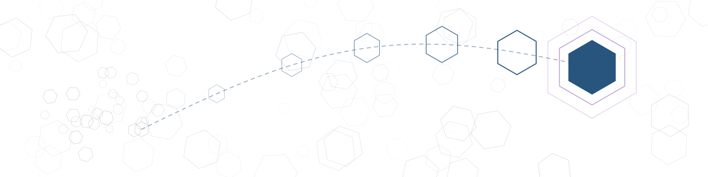

<p align="center">
  
</p>

# 🤔 aiduMEI — AI Wisdom Engine

> **Not just memory — thinking.**
>
> *Optimization is not refactoring code, but implanting excellent logic;*
> *Memory is not note-taking, but never forgetting the details of the past;*
> *Thinking is not reasoning, but doing everything with reason and result.*

[](LICENSE)
[](https://www.python.org/)
[](https://github.com/mem0ai/mem0)

**[📖 中文文档](README.md)** | **English**

---

## What is aiduMEI?

aiduMEI is an **AI Wisdom Engine** — a persistent memory and reasoning system for AI Agents. The current public release is **v20.1** — deterministic fallbacks and honest recall: the memory system stays complete when no LLM is present, and honestly says "not found" when recall cannot be trusted. Published after all 17 remediation items from five external reviews were closed. It embodies a complete **cognitive architecture** that enables AI to **remember, think, and evolve**.

<!-- distribution-policy: github-source-only -->
> **Distribution (GitHub-only):** aiduMEI no longer publishes or maintains packages on PyPI or GHCR. Get ongoing updates from the repository's `main` branch or formal versions from [GitHub Releases](https://github.com/monkey2jack/aiduMEI/releases). The `pip install -r requirements.txt` command below installs dependencies from a cloned source tree; it is not a package distribution method.

Built on top of [mem0](https://github.com/mem0ai/mem0), aiduMEI adds a version-by-version cognitive framework:

| Layer | Codename | What it does | Key Feature |
|-------|----------|-------------|-------------|
| 🦉 **Wisdom** | Athena | How to grow wiser after remembering | Active Reflect · memory self-editing · recursive refinement · skill growth · persona memory layer |
| 🧠 **Recall** | Mnemosyne | Find the right memory at the right time | Ebbinghaus decay + BM25/trigram + vector hybrid search |
| 🔍 **Gate** | Tahoe-Gate | Only retrieve what's actually relevant | Heuristic gate (`GET /gate`) blocks irrelevant context — casual chat skips retrieval, saving tokens & compute |
| 🌊 **Tidal** | Mnemosyne Tidal | Batch LLM extraction, not one-by-one | Async coalescing queue: multiple short messages → single LLM call |
| ⏳ **Decay** | Ebbinghaus | Forgetting is a feature, not a bug | Three-lane decay: Identity zero-decay / Emotion accelerated / General standard curve |
| 🕰️ **Chronos** | Chronos | Time-aware validity | Dual timeline (valid_from / valid_to), deprioritize without deletion |
| 🏛️ **Pantheon** | Pantheon | Many agents, one memory | Federated identity + MoE gating + 4-tier graceful degradation |
| 🛡️ **Aegis** | Aegis | Zero hardcoding, clone and run | Identity / paths / keywords all injected via env vars |
| 🌈 **Iris** | Iris | Rides the host's native memory channel | Hermes MemoryProvider plugin: pre-compress rescue · memory mirroring · direct tools |
| 🐙 **Octopod** | Opus Octopod | Memory governance & crystallization | ConflictResolver + TreeMemory + SkillCrystallizer |
| ⚡ **Zeus** | Zeus | King of the Gods | Raw Drawer + Code Graph + EvolveMem self-evolving retrieval + **multimodal vision memory · Obsidian bi-directional links · lossless fast-update** |

---

## Why v20.0 Is a Major Release

v19.5.0 and this release do **not** change the same layer.

| | v19.5.0 | **v20.0** |
|---|---|---|
| Character | **Discipline release** | **Architecture release** |
| What changed | The release process — **zero runtime behaviour change** | The **ownership model** of memory (a data-plane contract) |
| One-line theme | Don't let out what shouldn't be said | Don't let mix what shouldn't be mixed |
| Should you upgrade | Optional; nothing functional depends on it | **Recommended** — it fixes a class of silent data loss |
| Total test cases | ~700 | **1254** |

Three reasons, each harder than the last:

**① Memory is no longer one big pool — and this is not "adding a field".**

Before v19, "who does this memory belong to, and to which domain" was expressed as a *side job* of channel markers like `source` / `agent_id`. But a channel is not ownership. The moment two unrelated memory domains collide on the same key, **the later write silently destroys the earlier one — no error on either side, no log line, no counter moves.**

v20 turns scope from a *convention* into a *contract*: write, query, delete, restore, aggregate, feedback, background jobs, the event ledger, the graduation chain, persona profiles — **every online read/write path must state which domain it operates on**, and an invalid scope raises *before* any data is fetched rather than silently degrading into a full-table scan.

The migration is fully additive: **not one existing row is modified or removed**, legacy data lands in the `default` domain, and key shapes stay byte-identical to v19.

**② Benchmarking moves from "trust us" to a reproducible protocol.**

New `benchmarks/`: dataset, model, judge, prompt, seed and file hashes are all pinned and evidenced; the adapter goes through the **real HTTP contract** rather than an in-process shortcut — otherwise you are testing your own functions, not this service. The oracle is a retrieval-ceiling diagnostic only and **never enters the headline**.

**③ Shipped deployment artifacts no longer run as root by default.**

Both systemd units and the container image ran as root — that was the status quo. This release drops the units to a dedicated account with an empty capability set, a read-only filesystem and a syscall filter. Measured before/after on a production box (both computed by `systemd-analyze` itself): **exposure 9.6 UNSAFE → 1.7 OK, capabilities 41 → 0**.

---

## Why We Retired the Greek-God Codenames

From v9 through v19 every major release carried a god: Mnemosyne, Chronos, Aegis, Pantheon, Zeus, Athena. Godhead-as-architecture helped us explain the design. **It was not a mistake — it simply outgrew its usefulness.**

Three concrete reasons, none of them aesthetic:

**1. The codenames crept into machine contracts.** A codename should be poetry for humans, but ours leaked into module names, log prefixes and health-probe keys. Renaming stopped being a copy edit and became **a change to a machine contract** — production log collection filters on a prefix, so after a rename the service still starts and still logs, it just **stops being collected**. The cost of such a change is wildly out of proportion to its benefit.

**2. Version numbers stopped conveying weight.** `v19.4.2` plus a codename gives the reader no way to tell a major release from a patch — which is a version number's first job.

**3. A godhead is a promise, and stacking them writes cheques you can't cash.** With a dozen gods side by side, each one implies "there is a complete capability here". Real software is thick in places and thin in others; using a god's name on the thin parts is **overclaiming that's hard to notice**.

So from v20.0 on: **two-segment version numbers, and no runtime codename.**

This is not a disavowal of the history — the full *Pantheon* table below stays, because **not one of those capabilities was deleted; they are all still running**. They simply move from "runtime identity" to "landmarks in the evolution history", which is where they belong.

---

## How We Compare — Where We're Strong, Where We're Not

Up front: we and the "zero-dependency, purely local" class are **not the same kind of product**, and neither is chasing the other. They optimise for "one pip install, no network, sub-millisecond". We optimise for "multi-tenant, governable, every change on the ledger".

### Capabilities (qualitative)

| Capability | aiduMEI | Zero-dep local class | Hosted cloud class |
|---|:---:|:---:|:---:|
| Multi-tenant / memory-domain isolation | **✅ `(user_id, bank_id)` contract** | ✗ explicitly designed for single agent, single machine | partial |
| Dual timeline (memory **expires** instead of being deleted) | **✅ `valid_from` / `valid_to`** | ✗ | ✗ |
| Write governance + human review | **✅ sync rules + async LLM second pass** | ✗ | ✗ |
| Event ledger (who changed what, when) | **✅ across all paths** | ✗ | partial |
| Verbatim fidelity (exact wording kept, not only the distillate) | **✅ Verbatim Vault** | ✗ | ✗ |
| Cross-machine federation (many agents, one memory) | **✅ federated identity + MoE gating** | ✗ | partial |
| Reranking (true cross-encoder) | **✅ bge-reranker-v2-m3** | ✗ weighted fusion only | partial |
| Embedding model | **bge-m3 · 1024-dim · multilingual** | small local model | varies |
| Zero dependencies / fully offline | ✗ **needs embedding + rerank services** | **✅ their strength** | ✗ |
| Sub-millisecond latency | ✗ | **✅ their strength** | ✗ |
| Free / self-hosted | ✅ MIT, self-hosted | ✅ | mostly paid |

> ⚠️ **One boundary we must state plainly: multi-tenant ≠ a SaaS security boundary.**
> aiduMEI is a **single-machine self-hosted** engine. The tenant dimension separates memory ownership
> between different agents/identities **inside one deployment**; it is **not** an isolation layer for
> putting mutually untrusted external customers on one box. For that, run one deployment per customer.
> We spell this out because "tenant" is easy to over-read — and over-reading it causes real security misjudgement.

### What connecting to external models buys us

This is a **trade-off**, not a shortcoming, and it deserves to be stated:

- **Reranking ≠ weighted fusion.** Fusion adds up scores you already have; a cross-encoder **re-reads the query and the document together** and scores them. On long-document retrieval that step is typically worth 10–20 points.
- **The embedding tier gap is real.** To fit inside "zero dependencies and sub-millisecond", the embedding model has to be small. We use bge-m3 (1024-dim, multilingual, particularly strong on Chinese).
- **The LLM buys extraction quality.** Zero dependencies means no LLM, so "auto-consolidation/summarisation" can only be rules or truncation. Our fact extraction, conflict resolution and governance evaluation are all LLM-driven.

**And the cost, stated plainly: we need the network, we have latency, we have API cost.** For fully offline, sub-millisecond use cases that class genuinely fits better — we won't pretend otherwise.

### On reading other people's numbers

Not aimed at any one project; this is endemic to self-published benchmarks. **Both rows below simply hold two numbers from the same vendor's own page against each other:**

| Headline number | Another number on the same page |
|---|---|
| "**<1ms** query latency" | their own speed table: search **45ms**, vector search **15ms** — and that is at **1,000 entries** |
| "**98.9%** LongMemEval" | that is **Recall@All@5** (is the answer in the top 5?); the same page reports **end-to-end QA at 65.2%** |

Two conclusions:

1. **1ms is a bare database row read, not a semantic search.** You cannot run a cross-encoder rerank or an LLM extraction in 1ms — **that number is itself the receipt for having skipped them.**
2. **`Recall@k` (can it be found) and end-to-end accuracy (is the answer right) are different metrics**, and published material often shows a gap of 30+ points. A metric sitting near 99% is usually **saturated and has lost its discriminating power** — making a saturated metric your headline is a choice.

---

## On Benchmarks: Where We Stand

**This release has not been benchmarked, so this page claims no score.**

We are actively preparing our own benchmark run, working at it like other vendors do — the difference being that we intend to **hand over the reproduction method along with the number**.

The protocol is already in place (`benchmarks/`): dataset, model, judge, prompt, seed and file hashes are pinned and evidenced, and the adapter goes through the real HTTP contract. Which means that on the day we publish a score, the same protocol should give you the same number — **that is the only form in which we think a score means anything.**

Why we would rather hand in a blank page than a placeholder figure:

- **This release's whole rule is "a claim is a commitment".** We even removed an assertion over a single phrase: the line "all axes present: derived, never measured" became false the moment we actually measured it, so it was changed to a dated, measured value the same day. Putting a guessed score on the same page would undo exactly that.
- **The value of a first benchmark run is exposing problems, not scoring points.** During development we repeatedly hit "looks fine, actually idling": a reasoning model returning empty for every question under a token cap while the scoreboard reported zero failures; an embedding-dimension parameter shipped wrong from the factory template. A real run will most likely surface a few of those first, and the first number will be visibly lower than the second — as it should be.

**The formal run lands soon, published with the full reproducible record — including the failures, not just the flattering parts.**

---

## Get Started in 30 Seconds

### Method 1: Clone & Run from GitHub Source (official source channel)

```bash
# 1. Clone
git clone https://github.com/monkey2jack/aiduMEI.git
cd aiduMEI

# 2. Create virtual environment
python3.12 -m venv venv
source venv/bin/activate

# 3. Install dependencies
pip install -r requirements.txt

# 4. Configure (copy and edit)
cp mem0_config_local.json.example mem0_config_local.json
# Edit mem0_config_local.json with your LLM and embedding API keys

# 5. Start
python api_server.py
# API runs on http://localhost:8767
```

---

## 📦 Deployment Footprint — Light Enough for an Entry-Level VPS

> A common question: how heavy is this to run? **Answer: very light — by design.**

| Dimension | Measured | Notes |
|-----------|----------|-------|
| **Memory** | **~210 MB RSS** (single process, measured) | mem0 kernel + FastAPI + embedded vector store in one Python process |
| **CPU** | **2 cores plenty, < 1% idle** | No heavy resident compute; LLM/Embedding all via external API |
| **Disk (program)** | ~2.6 MB source · ~175 MB venv | Pure Python, no compilation, clone & run |
| **Disk (data)** | ~13 MB vectors + few-hundred KB SQLite per thousands of memories | Grows linearly, tiny scale |
| **Direct deps** | **only 9 top-level packages** | mem0ai / qdrant-client / fastapi / uvicorn / pydantic family / httpx / requests |
| **Python** | 3.10 – 3.12 | 3.12 recommended |
| **Frontend** | **0 dependencies** | Pure static console — no node, no bundler, no compile |

**Why it's this light, deliberately:**

- **Embedded on-disk vector store** (Qdrant `path` mode) — no separate service, no Docker, no extra port.
- **Compute outsourced** — LLM / Embedding / Rerank all via OpenAI-compatible APIs; no model weights loaded locally, so no GPU, no big RAM.
- **Relevance gate first** — casual chat skips retrieval, saving tokens and compute.
- **SQLite + FTS5 fallback** — structured knowledge and full-text search on zero-dependency SQLite; hot-switches from vector to full-text on timeout.

> In short: **a 1-core/1 GB entry VPS runs it; 2-core/2 GB is comfortable.** The heavy lifting (LLM inference) lives in the cloud API — locally it's a lean memory-and-retrieval brain.

---

## Architecture

```
┌──────────────────────────────────────────────────────────┐
│        🦉 aiduMEI v20.1 · AI Wisdom Engine            │
│              FastAPI REST API :8767                       │
│              MCP Server :8768 (41 tools)                  │
├──────────────────────────────────────────────────────────┤
│  Athena          → Reflect · Self-Edit · Refine · Skill Growth · Persona │
│  Core (HOT)      → Search, Add, CRUD, Health              │
│  v8 Pipeline     → Ignition · Workspace · Broadcast ·     │
│                    Mirror · Session                        │
│  Clotho/Hyperion → CoreMemory · Checkpoint · AutoDream    │
│  Extended        → Auto-memory · Expiry · Stats           │
│  Federation      → Multi-agent Fed · MoE gate · 4-tier    │
│  Octopus         → Conflict · Tree Memory · Crystals      │
│  Zeus            → Raw Drawer · Code Graph · Evolve       │
│  Themis          → Event Ledger · Sensitivity · Audit     │
├──────────────────────────────────────────────────────────┤
│  mem0 (vector memory) + Qdrant (embedding store)          │
│  facts.db (structured knowledge · FTS5 trigram search)    │
│  EvolveMem self-evolving retrieval engine                 │
└──────────────────────────────────────────────────────────┘
```

---

## What Makes aiduMEI Unique

### 🔮 Relevance Gate (Tahoe-Gate)
Most RAG systems search memory for every single message. aiduMEI's **Relevance Gate** (`GET /gate`) uses heuristics + dynamic entity matching to determine if the current message actually needs memory retrieval. Casual chat skips retrieval entirely → saves tokens and compute. Hosts call the gate before injecting memory context.

### 🌊 Tidal Coalescing (Mnemosyne Tidal)
Short messages don't trigger individual LLM calls. They're buffered asynchronously by session, then batched into a single LLM call. Three-tier strategy: Tech / Intimate / Default — fast for code, deep for personal.

### ⏳ Three-Lane Ebbinghaus Decay
Memories have expiration dates. Identity and Preference are permanent lanes (zero decay), Emotion decays 1.5× faster, general facts follow the standard forgetting curve. **Teach AI to forget what doesn't matter.**

### 🕰️ Chronos Dual Timeline
`valid_from` / `valid_to` time windows: expired facts are deprioritized but never deleted, future facts are sorted behind. All governance-type memories (identity/preference lane) never expire.

### ⚡ Raw Drawer (Zeus v18.0)
Inspired by MemPalace's (58k⭐) Verbatim Storage. Zero-LLM raw text storage — code snippets, full conversations, raw logs bypass LLM summarization entirely. FTS5 full-text index + Qdrant vector + facts registration, three pipelines in parallel.

### 🔍 Code Graph (Zeus v18.0)
Inspired by code-review-graph's (29k⭐) AST blast radius analysis. Uses Python's standard `ast` library to parse project dependencies. Change one file, instantly see the impact. 724 functions · 936 imports, full-graph scan in 468ms.

### 📈 EvolveMem Self-Evolving Retrieval (Zeus v18.1)
Inspired by SimpleMem's (3.7k⭐) evolution concept. Users rate each retrieval result (useful / useless / correction). Background thread runs every 6 hours to auto-compute decay/boost. High-quality frequent entries auto-consolidate, low-quality ones gently deprioritize. **Closed-loop feedback — gets smarter with use.**

### 🏛️ Pantheon Federation
Inspired by MoE (Mixture-of-Experts): a complete multi-agent federation infrastructure underneath, with only the current agent's hot channel active day-to-day.

- **Federated Identity**: Every memory carries `agent_id` / `profile` / `shared` — multiple agents share one database without cross-contamination
- **MoE Gating**: Default hot channel (single SQL, 5ms level); other agents only awakened on explicit request
- **Four-Tier Graceful Degradation**: L1 local → L2 tiered-weight → L3 same-profile federation → L4 cross-profile global
- **Write Dedup**: Jaccard three-state — ≥0.85 merge, ≥0.70 update, <0.70 insert

### 🐙 Conflict Resolution & Skill Crystallization (Opus Octopod — v16.0)

- **ConflictResolver**: Domain migrations, name changes auto-detected + old values deprioritized. Dual timeline invalidation instead of deletion
- **TreeMemory**: `node_path` hierarchical tracing, facts mounted to tree nodes, ancestor traversal supported
- **SkillCrystallizer**: Background auto-detection of high-frequency repeated facts,提炼ed into Skill candidates. **LLM can only suggest — human approval required to activate**

### 🛡️ Aegis Shield (v14.0)
Zero hardcoded identities, absolute paths, server addresses, or secrets in the repository. Everything configurable goes through environment variables. Clone to any directory, any machine — `python api_server.py` just works.

### 🌈 Iris Rainbow Bridge (v15.0)
aiduMEI provides an **official Hermes Agent MemoryProvider plugin** with full lifecycle hooks — turn-start injection of persistent blocks & relevant retrieval, background archiving every turn, **pre-compress rescue of about-to-be-discarded conversations into long-term memory**, mirroring of the host's built-in MEMORY.md writes, and three directly callable tools.

```bash
cp -r integrations/hermes-plugin/aidumei ~/.hermes/plugins/
hermes config set memory.provider aidumei
```

### 🔧 Zero-Config Hybrid Search
BM25 trigram (zero-latency fallback) + vector embedding vectors + Reranker + recall funnel relevance ranking. Vector service timeout triggers automatic hot-switch to local full-text search.

---

## Core API Endpoints

### Memory Operations

| Method | Path | Description |
|--------|------|-------------|
| `POST` | `/search` | Search memories (hybrid: vector + BM25 + relevance gate) |
| `POST` | `/search_trace` | Search with full execution trace |
| `POST` | `/add` | Add memories (async tidal coalescing by default) |
| `POST` | `/add/raw` | Raw Drawer — zero-LLM verbatim storage |
| `DELETE` | `/delete` | Delete a memory by ID |
| `GET` | `/health` | Health check with full probe diagnostics |

### Code Graph (Zeus v18.0)

| Method | Path | Description |
|--------|------|-------------|
| `POST` | `/code/impact` | Analyze file change blast radius |
| `GET` | `/code/graph` | View full project dependency graph |

### Retrieval Evolution (Zeus v18.1)

| Method | Path | Description |
|--------|------|-------------|
| `POST` | `/evolve/feedback` | Submit retrieval quality feedback (useful / useless / correction) |
| `GET` | `/evolve/report` | Evolution stats panel (recall rate, weight adjustment history) |

### Octopus Governance (Opus v16.0)

| Method | Path | Description |
|--------|------|-------------|
| `POST` | `/conflict/resolve` | Conflict resolution (domain migration, name changes auto-detect) |
| `GET` | `/tree/nodes` | Tree memory node listing |
| `POST` | `/crystals/detect` | Detect crystallizable high-frequency facts |
| `GET` | `/crystals` | View skill crystal candidates |

### Athena Cognitive Layer (v19.0)

| Method | Path | Description |
|--------|------|-------------|
| `POST` | `/reflect` | Trigger active reflection into insights |
| `GET` | `/reflect/list` | List stored reflection insights |
| `GET` | `/reflect/context` | Injectable reflection summary |
| `GET` | `/self-edit/edits` | Memory self-edit (merge/conflict) history |
| `POST` | `/self-edit/rollback` | Roll back a self-edit |
| `GET` | `/memory/types` | Six memory types & distribution |
| `POST` | `/memory/types/query` | Retrieve memories by type |
| `POST` | `/memory/refine` | Trigger recursive refinement |
| `POST` | `/memory/refine/rollback` | Roll back a refinement |
| `POST` | `/skill/grow` | Grow a SKILL.md draft from a task trace (needs approval) |
| `POST` | `/crystals/use` | Skill reuse scoring (success/fail) |
| `POST` | `/crystals/prune` | Retire low-utility skills (archive, not delete) |

### Persona Memory Layer (v19.0)

| Method | Path | Description |
|--------|------|-------------|
| `POST` | `/persona/build` | Build a persona bank (`synthesis` / `grounded` dual mode) |
| `GET` | `/persona/banks` | List persona banks |
| `POST` | `/persona/retrieve` | Context-based persona retrieval |
| `POST` | `/persona/rollback` | Roll back to a historical persona version |

### Pantheon Federation (v13.0)

| Method | Path | Description |
|--------|------|-------------|
| `GET` | `/federation/recall` | Federated recall (MoE gate auto-decides hot/fed channel) |
| `POST` | `/federation/facts/add` | Federated write (auto dedup + tiering + attribution) |
| `GET` | `/federation/agents` | Agent list with fact counts & online status |
| `POST` | `/federation/agents/register` | Register an agent to the federation |
| `GET` | `/federation/broadcast` | Pull new shared facts from other agents |
| `GET` | `/federation/awareness` | Federation situational summary |

### Examples

```bash
# Search memories
curl -s -X POST http://localhost:8767/search \
  -H "Content-Type: application/json" \
  -d '{"query": "What was the project deadline I mentioned?", "user_id": "me", "limit": 5}'

# Add a memory
curl -s -X POST http://localhost:8767/add \
  -H "Content-Type: application/json" \
  -d '{"messages": "[{\"role\":\"user\",\"content\":\"Project deadline is March 15\"}]", "user_id": "me"}'

# Raw Drawer — store code snippets verbatim, zero LLM
curl -s -X POST http://localhost:8767/add/raw \
  -H "Content-Type: application/json" \
  -d '{"content": "def hello(): print(\"Hello World\")", "source": "my_script.py", "user_id": "me"}'

# Blast radius analysis
curl -s -X POST http://localhost:8767/code/impact \
  -H "Content-Type: application/json" \
  -d '{"file_path": "ducky/utils.py"}'

# Retrieval feedback — tell the system how good the search was
curl -s -X POST http://localhost:8767/evolve/feedback \
  -H "Content-Type: application/json" \
  -d '{"query": "project deadline", "rating": "useful", "user_id": "me"}'
```

---

## Hermes Agent Integration

| Method | Capabilities | When to Use |
|--------|-------------|-------------|
| **A. MemoryProvider Plugin** (recommended) | Full lifecycle hooks + tools + backup | Default choice |
| **B. Shell Hook** | Turn-start injection only | When host can't install plugins |

**Do not enable both simultaneously** (duplicate injection wastes tokens). See [integrations/INTEGRATION_GUIDE.md](integrations/INTEGRATION_GUIDE.md) for full steps, verification, and rollback.

> ⚠️ **Security**: aiduMEI does not implement authentication itself and listens on `127.0.0.1` by default. For remote access, place a reverse proxy with authentication + TLS in front. Never expose the service directly to the public internet.

---

## MCP Server (41 Tools)

aiduMEI includes a built-in MCP Server (`:8768`) exposing 41 tools:

| Tool Group | Count | Description |
|------------|-------|-------------|
| Core CRUD | 6 | add / search / delete / update / recent / stats |
| Facts | 4 | facts_add / facts_search / facts_list / facts_delete |
| Code Graph | 2 | code_impact / code_graph |
| Session | 2 | session_list / session_history |
| Reflect | 2 | reflect_recent / reflect_trace |
| Core Memory | 3 | core_memory_get / core_memory_set / core_memory_list |
| AutoDream | 2 | dream_trigger / dream_status |
| Raw Drawer | 2 | raw_add / raw_search |
| Knowledge Tree | 3 | tree_nodes / tree_node / tree_ancestors |
| Crystals | 3 | crystals_list / crystals_detect / crystals_approve |
| Conflict | 1 | conflict_resolve |
| Evolve | 2 | evolve_feedback / evolve_report |
| Federation | 6 | fed_recall / fed_add / fed_agents / fed_register / fed_broadcast / fed_awareness |
| Persona (v19.0) | 3 | persona_build / persona_retrieve / persona_banks |

---

## IDE Integration

### Cursor

```bash
# Copy rule file to project
cp integrations/cursor-hook/cursor-aidumei.mdc .cursor/rules/

# Auto-store on file save → Raw Drawer
cp integrations/cursor-hook/aidumei-on-save.sh .git/hooks/post-commit
```

### Claude Code

```bash
python integrations/cursor-hook/claude-code-hook.py store --file my_code.py
python integrations/cursor-hook/claude-code-hook.py search --query "database connection"
python integrations/cursor-hook/claude-code-hook.py impact --file ducky/utils.py
```

---

## Tech Stack

- **Runtime**: Python 3.12+, FastAPI, Uvicorn
- **Memory Kernel**: mem0 v2.0.19 (v20.1)
- **Vector Store**: Qdrant (via qdrant-client)
- **Structured Data**: SQLite (facts.db, observations.db, scenes.db, fact_events.db)
- **Full-Text Search**: SQLite FTS5 + trigram tokenizer
- **Embeddings**: Configurable (OpenAI Embedding API compatible)
- **Reranking**: Configurable (OpenAI Rerank API compatible)
- **LLM**: Any OpenAI-compatible API
- **MCP**: fastmcp stdio + HTTP dual-mode

---

## Security Model (v19.4.1)

**One gate, two keys.** Both are accepted; either one grants access:

| Key | Who uses it | How |
|-----|-------------|-----|
| Session cookie | Browser console | `POST /login` with the console password; the server issues an HttpOnly, SameSite=Lax session cookie |
| Bearer token | Scripts, MCP, CI | `Authorization: Bearer <AIDUMEM_API_TOKEN>` |

The gate activates when **either** `AIDUMEM_API_TOKEN` is set **or** the console password is set explicitly
(via env var, or by changing it through the console). A password auto-generated at first boot guards the console
login only — it deliberately does **not** activate the REST gate, so existing loopback callers (Hermes plugin,
MCP, cron) keep working across an upgrade. Check `probes.auth_gate_enabled` in `/health` to see the current state.

**Tenant scoping is not a SaaS security boundary.** aiduMEI is a single-machine self-hosted engine; the tenant
dimension separates different agents/identities within one deployment. Recall-side scoping covers the facts layer
as of v19.4.1, and `AIDUMEM_STRICT_TENANT=1` switches to strict mode (no fallback for unlabeled historical rows).
If you need to host mutually untrusted parties, isolate by deployment instance rather than relying on this layer.

**Passwords** are stored as PBKDF2-HMAC-SHA256 (200k rounds) in `data/.ui_password_hash` with mode 0600;
pre-v19.4.1 single-round SHA-256 hashes are upgraded automatically on first successful login.

---

## Configuration

aiduMEI reads configuration from `mem0_config_local.json`. Key fields:

```json
{
  "llm": {
    "provider": "openai",
    "config": {
      "model": "your-model",
      "api_key": "your-key",
      "base_url": "your-endpoint"
    }
  },
  "embedder": {
    "provider": "openai",
    "config": {
      "model": "your-embedding-model",
      "api_key": "your-key",
      "base_url": "your-embedding-endpoint"
    }
  },
  "vector_store": {
    "provider": "qdrant",
    "config": {
      "collection_name": "aidu_mem",
      "host": "localhost",
      "port": 6333
    }
  }
}
```

---

## Environment Variables

Since v14 Aegis, all deployment-specific settings are injected via environment variables — **all optional**, safe defaults when unset.

| Variable | Default | Description |
|----------|---------|-------------|
| `AIDUMEM_HOME` | Repo root (auto-detected) | Override repository root |
| `AIDUMEM_DATA_DIR` | `<repo>/data` | Database & vector store location |
| `AIDUMEM_LOG_DIR` | `<repo>/logs` | Log directory |
| `AIDUMEM_CONFIG_FILE` | `<repo>/mem0_config_local.json` | mem0 config file path |
| `AIDUMEM_DEFAULT_USER_ID` | `default` | Default user_id |
| `AIDUMEM_DEFAULT_AGENT_ID` | `default` | Federation default agent_id |
| `AIDUMEM_ENTITY_KEYWORDS` | empty | Custom entity keywords for relevance gate, `\|` separated |
| `AIDUMEM_URL` | `http://127.0.0.1:8767` | Hermes plugin / hook service URL |
| `AIDUMEM_USER_ID` | `default` | Hermes plugin / hook memory namespace |
| `AIDUMEM_MIN_HISTORY` | `6` | shell hook: skip injection when session history below this |

Full list with comments: [`.env.example`](.env.example). Start with `cp .env.example .env`.

---

<p align="center">
  <sub>AI Wisdom Engine | Built by <a href="https://github.com/monkey2jack">aiduMEI Team</a></sub>
</p>

## Testing & Quality

```bash
# Full regression suite
pytest tests/
# Compile check
python -m compileall ducky api_server.py mcp_server.py
```

**Honest reporting of test scope (v19.4.1)**

| Dimension | Status |
|-----------|--------|
| Total cases | **1254** (measured via `pytest --collect-only`) |
| Clean dev machine | 1242 passed · **12 skipped** — no host Hermes source, git worktree present (measured) |
| Sandbox on the production box | 1253 passed · **1 skipped** — host Hermes source present, no git worktree (the sandbox is a whitelist copy without `.git`). **This row is axis-derived**: 1254 minus the 1 case gated on the git-worktree axis. The last real sandbox measurement was **859 passed · 1 skipped**, on the v20.0 committed tree, when the total was 860 |
| All axes present | 1254 all green · 0 skipped — **measured on the production box, 2026-08-26** (candidate tree cloned from a bundle, `.git` present, all ten axes available). The previous full-axis measurement was 1232 all green (earlier the same day, v20.1 candidate tree). Before that the row was a derived number, labelled "never measured" for several releases |
| Layers | Mostly module-level unit tests + source-level guard assertions; `TestClient`-driven API tests as a secondary layer |
| Platform preconditions | The full suite is maintained for **Linux/macOS (POSIX)**: the `backup_gate` axis needs a POSIX shell; `/health` CPU/RSS metrics use the `resource` module and honestly report `None` on non-POSIX platforms instead of crashing (v20.1 remediation). Windows is not a supported full-suite platform |
| Statement coverage | ~51% (`ducky/` plus entrypoints, measured with `coverage`) |
| Not covered | Real mem0/Qdrant integration, real LLM calls, concurrency stress — these depend on external services and are covered by production smoke tests |

> **Why report both 1242 and 1253**: the same suite yields different numbers in different environments,
> and quoting only one of them misleads the reader. 1242 is measured here; 1253 is **axis-derived** (1254 minus
> the git-worktree axis) — the last real sandbox measurement was 859, on the v20.0 committed tree when the
> total was 860. For every number, say whether it was measured or derived.
> Always state the environment alongside a test count.
>
> **Skips have more than one axis** (corrected by measurement in v20.0): this section used to recognise
> only the host-Hermes axis, and therefore treated "all green" as something you get simply by installing
> the host. Production said otherwise — the host *is* present in the sandbox, and the run
> still printed **1 skipped**. A full census found **ten independent skip axes** (the tenth, the mem0 base, joined in the v20.1 remediation round):
>
> | Skip axis | Gated cases | Location |
> |-----------|-------------|----------|
> | Host Hermes source | 12 | all of `tests/test_hermes_plugin.py` |
> | git worktree | 1 | `tests/test_v20_brand_policy.py` (needs `git ls-files` as its baseline) |
> | `scripts/backup_gate.sh` + POSIX shell | 7 | all of `tests/test_v19_4_1_backup_gate.py` |
> | `qdrant_client` installed | 1 | `tests/test_v20_vector_bank_contract.py` |
> | LoCoMo dataset present | 1 | `tests/test_v20_locomo_official.py` (the whole-dataset scan needs the real file) |
> | `regex` installed | 1 | `tests/test_v20_locomo_official.py` (differential-tests `regex` against stdlib `re`) |
> | `numpy` installed | 1 | `tests/test_v20_locomo_official.py` (differential-tests `numpy.mean` against `sum/len`) |
> | `nltk` installed | 13 | `tests/test_v20_locomo_official.py` and `tests/test_v20_benchmarks.py` (PorterStemmer for the official F1; swapping the stemmer stops it being the official metric) |
> | `git` executable present | 6 | `tests/test_v20_gitignore_guard.py` in full (uses a throwaway temp repo as the ignore oracle, never this repo's `.git`) |
> | `mem0ai` installed | 20 | all of `tests/test_v20_mem0_patch_layer.py` (patch-layer therapy tests need the real base; a missing mem0 used to be 20 ERRORs masquerading as real defects — now an honest skip) |
>
> A dev machine lacks the first → 1242 + 12. The sandbox on the production box lacks the second (whitelist copy, no
> `.git`) → 1253 + 1. **Each is missing one, so neither partial environment produces 1254 all green** — the
> is a derived number. The previous README claimed it was "verified on production", and the very
> production run it cited is what falsified it. This paragraph stays as a reminder: **an absolute claim
> must survive the measurement it cites.**
>
> ⚠️ **That row is about the sandbox, not the live deployed tree** (found while surveying before
> the v20.0 deployment): the deployed tree still carries a stale `.git` from an old clone — it is updated
> by file copy now, so its index lags the code — which means the git-worktree axis **does not skip**
> **there**. It would diff against an out-of-date `git ls-files` instead: a different kind of wrong, not
> the same number. The previous revision called this row "Deployed tree" while its own parenthetical
> said the measurement came from a sandbox — a contradiction inside a single table cell that I kept
> missing. **Report the tree you measured, and only that tree.**
>
> **Those 12 are reproducible, not folklore** (added in v19.4.2): they all live in
> `tests/test_hermes_plugin.py` and skip when the host's `agent/memory_provider.py` cannot be found.
> `HERMES_SRC` is a three-state switch, so **both directions reproduce**:
>
> ```bash
> pip install -r requirements-dev.txt                            # tests need pytest; requirements.txt omits it
> pytest tests/ -q -rs | tail -1                                 # no host: 1242 passed, 12 skipped
> HERMES_SRC=/path/to/hermes-agent pytest tests/ -q | tail -1    # with host: 1254 passed
> HERMES_SRC=none pytest tests/ -q -rs | tail -1                 # host present but forced off: 1242 passed, 12 skipped
> ```
>
> A "skip" you cannot turn back into a "pass" is just an unfalsifiable number — **and the converse holds
> too**. On a machine that happens to have the host installed (`/hermes/hermes-agent` is auto-discovered;
> our own production box is exactly that), the first command above actually prints 1253 passed, 1 skipped
> (**axis-derived**; the last real sandbox measurement was 859 passed, 1 skipped on the v20.0 committed tree,
> when the total was 860).
> That last skip sits on a different axis — git worktree. The sandbox is a whitelist copy with no `.git`,
> so `tests/test_v20_brand_policy.py` has no baseline to diff against. The `with host: 1254 passed` line in
> the code block above requires *all ten* axes present at once; that complete-axis result was measured on
> the production box on 2026-08-26 (candidate tree, total 1254, zero skips).
> Without the `HERMES_SRC=none` state, a reader simply cannot reproduce the "12 skipped" we claim.
> **Falsifiability requires reproducibility in both directions.**
>
> Also: if `HERMES_SRC` points somewhere without `agent/memory_provider.py`, resolution **raises**
> instead of silently falling back to an auto-discovered path — pointing at A while testing B,
> under a green light, is the hardest kind of false green to catch.

**Why spell this out**: v19.4.0's README only said "full suite: 244 passed", which reads like end-to-end assurance.
But 244 cases finishing in 0.88s clearly involve no real external dependency. More importantly, v19.4.0's
idempotency test was green while only covering `list[dict]` payloads carrying explicit timestamps — production
actually sends plain strings without timestamps, and a real bug shipped through that gap under a green light.

Since v19.4.1 we enforce an **anti-false-green rule**: any test touching payload shape, credential shape, or
query shape must cover *every* shape; performance and index assertions must verify self-evident fields such as
`_recall_path` rather than merely checking "did we get a hit".

---

## Known Limitations & Not Covered

The `(user_id, bank_id)` scope contract covers the **online read/write paths**. The three areas below are
**explicitly not covered** in this release. They are documented here rather than left for you to discover in production:

| # | Exception | Current state | Why not in this release |
|---|-----------|---------------|-------------------------|
| 1 | **`core_memory` key shape** | The table's primary key is still the single column `block_key` (`ducky/core_memory.py`). Isolation is enforced by the unique index `idx_core_memory_scope_key(user_id, bank_id, block_key_raw)` together with a write path whose `DO UPDATE SET` clause never touches the ownership columns | Changing the primary key shape is a **breaking** change and must come **after** existing rows have been reconciled to their true banks. Doing it in the other order would weld unreconciled data to the wrong bank |
| 2 | **Whole-database maintenance jobs** | Memory evolution and salience maintenance (`ducky/evolve_mem.py`, `ducky/routes_evolve.py`) scan the **whole database and do not isolate by bank**; this is annotated in the source docstrings | Whole-database maintenance is precisely their semantics — partitioning by bank would rob decay and consolidation of their global view. These jobs **never feed the user-visible retrieval path** |
| 3 | **Bank attribution of pre-existing data** | Memories carried over from v19 all land in the `default` bank and have **not** been reconciled to their true owners | The premise of an additive migration is that not one existing row is changed or deleted. True attribution requires business-side confirmation: that is data governance, not a code release |

**The boundary of the boundary**: exceptions 1 and 2 cannot cause one bank to read another's data — 1 is backstopped by
the unique index (writes never rewrite ownership columns), and 2 never enters the retrieval path. The impact of
exception 3 is "the bank label is inaccurate", not "banks leak into each other".

> This section is itself a discipline: whenever the README states isolation in absolute terms, a **list of known
> exceptions** must ship alongside it. Claiming "full" coverage without listing the exceptions leaves the user to
> find the boundary in production — the exact failure shape this project has paid for repeatedly.

---

## 🖥️ aiduMEI Console

> **Ships with a visual console since v18.2** — not just an API service, but an engine where you can *watch a memory being recalled*.

aiduMEI serves a lightweight web console straight from the backend at `/ui`. No separate frontend deployment, no build step — plain static HTML/CSS/JS, with ECharts (CDN) used only by the MAP panel. Six panels cover the full lifecycle of the memory engine:

| Panel | Codename | What it shows |
|-------|----------|---------------|
| 💗 **PULSE** | Service + storage tiers | Version/codename, per-module probes, four-tier memory volume and capacity |
| 🗄️ **VAULT** | Search + category ledger | Semantic search (vector + rerank), 6-domain category inventory, recent fact stream |
| 🗺️ **MAP** | Knowledge starfield | ECharts force graph: core / domain / category / entity nodes, drag and zoom |
| 🔍 **RECALL** | Recall funnel trace | Candidate pool → ignition → dedup → time decay → final, with per-stage latency and hit counts |
| 🧬 **EVOLVE** | Retrieval quality board | 7-day queries / hits / scores / zero-hits, evolution cycle log, feedback signals |
| ⚙️ **SETTINGS** | Models + modules + federation | LLM/Embedding/Reranker config (read-only, `api_key` masked), reasoning mode, tunables, module probes, federation members |

> This repository **ships no UI screenshots** — screenshots go stale with every release and tend to turn demo data into an implied product promise. Each panel is described in prose below; start the service and open `/ui` to verify for yourself. `tools/shot.js` (the CDP-driven, scroll-aware capture script we use ourselves) is included if you need to produce your own.

### PULSE — Vitals

Service health and version codename; **per-module** probes across 11 core modules (online / degraded / offline — a degraded probe names the specific module, rather than going green just because the process is alive); volume and capacity watermarks for each of the four memory tiers.

### VAULT — Memory Bank

Semantic search (vector recall + rerank scoring, results carry both score and source domain); category inventory across 6 knowledge domains with real per-domain counts; a recent fact stream in reverse chronological order, filterable by domain.

### MAP — Knowledge Starfield

An ECharts force-directed graph. Core / domain / category / entity nodes are sized from actual inventory; scroll to zoom, drag nodes, hover to see how many facts hang off a node and a sample of them.

### RECALL — Recall Funnel

> This is the panel aiduMEI cares most about: other memory dashboards tell you *what was stored*; this one tells you *why it was recalled*.

Candidate pool → 🔥 ignition → dedup → time decay → final. **Every stage reports its own latency and in/out counts**: what came in, what dropped it, what survived, and why the final set is what it is. Zero-hit queries render too — an empty result is still a result, and you can see exactly which stage it went empty at.

### EVOLVE — Self-Evolving Retrieval

A 7-day retrieval quality board: query count, average hits, average score, zero-hit count; below it, the evolution cycle log (what was tuned each round and on what evidence) and user feedback signals.

### SETTINGS — Model Configuration

LLM / Embedding / Reranker configuration is displayed **read-only** with `api_key` masked. The panel deliberately exposes no way to change a key — configuration flows only through server-side files and environment variables. Also shows reasoning-mode status, tunable parameters, core module probes, and the federation member list.

---

## Pantheon of Gods

> Major versions of aiduMEI were named after Greek deities — the god's domain reflects the architecture. From v20.0 on, versions return to plain two-segment numbers with no codename; the gods remain here as history.

| Version | Codename | Deity | Core Mission |
|---------|----------|-------|-------------|
| **v20.0** | — (no codename) | Memory-bank isolation · Scope as contract | **A `(user_id, bank_id)` two-dimensional scope contract across the online read/write paths (write / query / delete / restore / stats / feedback / ledger / graduation) · invalid scope rejected before any fetch · additive migration with zero change to existing data · `benchmarks/` reproducible evaluation protocol · `vector_backend` contract with shadow POC · observability carries bank / backend / degradation evidence** |
| **v19.5.0** | **Athena** | Goddess of Wisdom · The Redaction Gate | **A seven-surface scanner welded into the release chain (index-rendered page added) · the wordlist never enters the repo · an empty wordlist refuses to run rather than passing · the negative control is welded in, so the self-check is itself falsifiable · waivers bind to one line and stay in the report** |
| **v19.4.3** | **Athena** | Goddess of Wisdom · Release Hygiene | **Behaviourally identical to v19.4.2 (comments and version string only) · unpacking and scanning the distribution becomes a mandatory pre-upload gate · a scanner counts only after a negative control** |
| **v19.4.2** | **Athena** | Goddess of Wisdom · Guard Coverage & Credential Wiring | **Meta-test welds the guard's range · 8 credential entry points on one source of truth · `.env` fallback chain through standalone integrations · crashloops become visible · rotation stops losing logs · wordmark residue cleared · configuration written ≠ configuration in effect (`StartLimit*` section) · reproducible both ways is what makes it falsifiable (`HERMES_SRC` three-state)** |
| **v19.4.1** | **Athena** | Goddess of Wisdom · Audit Patch | **One gate, two keys · tenant visibility scoping & cross-tenant overwrite fix · cascade delete covers the Verbatim Vault · idempotency key & Chinese index alignment** |
| **v19.4.0** | **Athena** | Goddess of Wisdom · Project Mirror · Audit Fix | **Verbatim Vault · Verbatim-evidence fused recall · Server-side injection frame · LLM hardening · Noise rule upgrade · Backup hard gate · Ledger alias expansion · Secondary-path governance & ledger** |
| **v19.3.3** | **Athena** | Goddess of Wisdom · Architectural Unification | **Single-source scoring · Singleton concurrency hardening · Unified injection gate · Silent-exception observability · Legacy decoupling** |
| **v19.2.0** | **Athena** | Goddess of Wisdom · Production Hardening | **Prompt injection defense · Multi-store cascade delete & WAL · Unified scoring · Dynamic health** |
| **v19.0** | **Athena** | Goddess of Wisdom · From Memory to Wisdom | **Active Reflect · memory self-editing · recursive refinement · skill growth · persona memory layer** |
| **v18.3** | **Zeus** | King of the Gods · Multimodal | Lossless fast-update · multimodal vision memory · Obsidian bi-directional links · console password change |
| **v18.2** | **Zeus** | King of the Gods · Insight | Built-in aiduMEI console · EvolveMem feedback loop · quality audit |
| **v18.1** | **Zeus** | King of the Gods · Self-Evolving | EvolveMem feedback loop · 38 MCP tools · quality audit |
| **v18.0** | **Zeus** | King of the Gods · Power Absorption | Raw Drawer · Code Graph · 5 competitors精华 fusion · MCP×36 · IDE hooks |
| **v17.0** | **Themis** | Goddess of Order | Event ledger · sensitivity tiers · governance rules |
| **v16.0** | **Opus Octopod** | Deep-sea Sage | Conflict resolution · tree memory · skill crystallization |
| **v15.0** | **Iris** | Rainbow Messenger | Official MemoryProvider channel · lazy hot-reload |
| **v14.0** | **Aegis** | Divine Shield | Zero hardcoding · privacy shield · deploy anywhere |
| **v13.0** | **Pantheon** | Hall of Gods | Multi-agent federation · MoE gating |
| **v12.0** | **Chronos** | God of Time | Dual timeline validity |
| **v11.0** | **Hyperion** | Titan of Light | Thread-local connection pool · performance era |
| **v9.1** | **Mnemosyne** | Goddess of Memory | Tidal coalescing · dual-strategy tiering |

[Full version history →](CHANGELOG.md)

---
